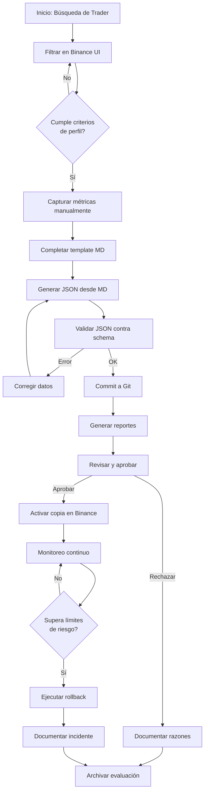
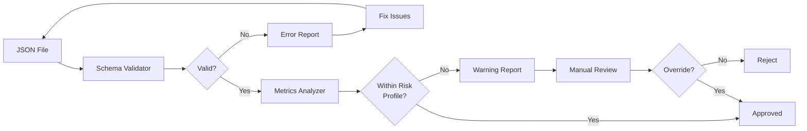
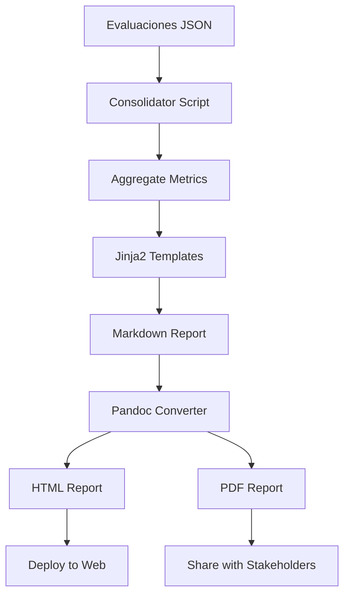

# 🏗️ Arquitectura del Sistema de Evaluación de Traders

## 📋 Índice

1. [Visión General](#visión-general)
2. [Estructura del Proyecto](#estructura-del-proyecto)
3. [Componentes Principales](#componentes-principales)
4. [Flujo de Trabajo](#flujo-de-trabajo)
5. [Esquemas de Datos](#esquemas-de-datos)
6. [Scripts y Automatización](#scripts-y-automatización)
7. [Versionado y Trazabilidad](#versionado-y-trazabilidad)
8. [Seguridad y Validación](#seguridad-y-validación)

---

## 🎯 Visión General

Sistema de evaluación, documentación y seguimiento de traders de Binance Copy Trading, diseñado para:

- **Auditoría**: Trazabilidad completa de decisiones de inversión
- **Reproducibilidad**: Proceso estandarizado y documentado
- **Control de Riesgo**: Métricas cuantitativas y límites definidos
- **Versionado**: Tracking histórico de evaluaciones y cambios

### Principios de Diseño

1. **Separation of Concerns**: Datos, lógica y presentación separados
2. **Schema-First**: Validación estricta mediante JSON Schema
3. **Git as Source of Truth**: Versionado completo de evaluaciones
4. **Automation with Oversight**: Scripts automatizan, humanos deciden
5. **Multi-Format Output**: MD/HTML/PDF para diferentes audiencias

---

## 📁 Estructura del Proyecto

```
akira-traders/
├── README.md                          # Documentación principal
├── ARCHITECTURE.md                    # Este documento
├── CONTRIBUTING.md                    # Guía de contribución
├── .gitignore                         # Exclusiones Git
├── requirements.txt                   # Dependencias Python
├── pyproject.toml                     # Configuración Python
│
├── docs/                              # Documentación técnica
│   ├── methodology.md                 # Criterios de selección
│   ├── risk-profile.md                # Definición de perfiles de riesgo
│   ├── limitations.md                 # Limitaciones conocidas
│   ├── workflow.md                    # Flujo de trabajo detallado
│   └── glossary.md                    # Glosario de términos
│
├── schemas/                           # JSON Schemas
│   ├── trader-evaluation.schema.json  # Schema principal
│   ├── risk-profile.schema.json       # Schema de perfil de riesgo
│   └── report-config.schema.json      # Schema de configuración
│
├── templates/                         # Plantillas
│   ├── markdown/
│   │   ├── trader-evaluation.md       # Template evaluación individual
│   │   ├── executive-summary.md       # Template resumen ejecutivo
│   │   └── technical-annex.md         # Template anexo técnico
│   └── jinja2/
│       ├── executive-report.j2        # Template informe ejecutivo
│       ├── technical-report.j2        # Template informe técnico
│       └── consolidated-report.j2     # Template reporte consolidado
│
├── evaluations/                       # Evaluaciones de traders
│   ├── 2025-01/                       # Organizadas por mes
│   │   ├── trader_example_20250107.json
│   │   └── trader_example_20250107.md
│   └── archive/                       # Evaluaciones históricas
│
├── reports/                           # Reportes generados
│   ├── executive/                     # Reportes ejecutivos
│   ├── technical/                     # Reportes técnicos
│   └── consolidated/                  # Reportes consolidados
│
├── scripts/                           # Scripts Python
│   ├── __init__.py
│   ├── validate.py                    # Validación de JSON
│   ├── generate_report.py             # Generación de reportes
│   ├── analyze_metrics.py             # Análisis de métricas
│   ├── consolidate.py                 # Consolidación de evaluaciones
│   └── utils/
│       ├── __init__.py
│       ├── schema_validator.py        # Validador de schemas
│       ├── report_generator.py        # Generador de reportes
│       ├── metrics_calculator.py      # Calculadora de métricas
│       └── git_helper.py              # Helpers para Git
│
└── .github/                           # GitHub workflows
    └── workflows/
        └── validate-evaluations.yml   # CI/CD para validación
```

---

## 🧩 Componentes Principales

### 1. Sistema de Evaluación

**Propósito**: Capturar y estructurar información de traders

**Componentes**:
- Plantilla Markdown para evaluación manual
- Schema JSON para validación automática
- Metadata estandarizada (fecha, perfil, criterios)

**Flujo**:
```
Usuario → Binance UI → Captura manual → Template MD → Conversión JSON → Validación
```

### 2. Motor de Validación

**Propósito**: Garantizar integridad y consistencia de datos

**Componentes**:
- JSON Schema definitions
- Script de validación Python
- Pre-commit hooks
- CI/CD checks

**Validaciones**:
- ✅ Estructura JSON correcta
- ✅ Tipos de datos válidos
- ✅ Rangos de métricas dentro de límites
- ✅ Campos requeridos presentes
- ✅ URLs válidas
- ✅ Fechas en formato ISO 8601

### 3. Generador de Reportes

**Propósito**: Producir documentación para diferentes audiencias

**Componentes**:
- Templates Jinja2
- Script de generación Python
- Conversores MD → HTML → PDF

**Outputs**:
- **Ejecutivo**: Resumen de 1-2 páginas para stakeholders
- **Técnico**: Análisis detallado con métricas y rationale
- **Consolidado**: Comparativa de múltiples traders

### 4. Analizador de Métricas

**Propósito**: Calcular scores y rankings de traders

**Componentes**:
- Calculadora de métricas de riesgo
- Sistema de scoring ponderado
- Comparador de traders
- Detector de anomalías

**Métricas Calculadas**:
- Risk-Adjusted Return (Sharpe-like)
- Consistency Score
- Drawdown Recovery Time
- Win/Loss Ratio
- Risk Score (0-100)

### 5. Sistema de Versionado

**Propósito**: Tracking histórico de evaluaciones y decisiones

**Componentes**:
- Git como backend
- Convenciones de commit
- Tags para releases
- Changelog automático

**Estrategia**:
```
main (producción)
  ├── evaluations/YYYY-MM/trader_name_YYYYMMDD.json
  └── reports/consolidated/YYYY-MM.pdf

Commits semánticos:
  - feat: Nueva evaluación de trader
  - update: Actualización de métricas
  - fix: Corrección de datos
  - docs: Actualización de documentación
```

---

## 🔄 Flujo de Trabajo

### Diagrama de Flujo Principal



### Flujo de Validación



### Flujo de Generación de Reportes



---

## 📊 Esquemas de Datos

### Schema Principal: Trader Evaluation

```json
{
  "$schema": "http://json-schema.org/draft-07/schema#",
  "title": "Trader Evaluation",
  "type": "object",
  "required": [
    "as_of_utc",
    "risk_profile",
    "selection_criteria",
    "candidate"
  ],
  "properties": {
    "as_of_utc": {
      "type": "string",
      "format": "date-time",
      "description": "Timestamp de la evaluación en UTC"
    },
    "risk_profile": {
      "type": "string",
      "enum": ["conservative", "moderate", "aggressive"],
      "description": "Perfil de riesgo objetivo"
    },
    "selection_criteria": {
      "type": "object",
      "description": "Criterios de selección aplicados",
      "required": [
        "roi_90d_range_pct",
        "max_drawdown_pct_lte",
        "win_rate_pct_gte",
        "min_days_active",
        "leverage_range",
        "min_copiers"
      ],
      "properties": {
        "roi_90d_range_pct": {
          "type": "array",
          "items": {"type": "number"},
          "minItems": 2,
          "maxItems": 2
        },
        "max_drawdown_pct_lte": {
          "type": "number",
          "minimum": 0,
          "maximum": 100
        },
        "win_rate_pct_gte": {
          "type": "number",
          "minimum": 0,
          "maximum": 100
        },
        "min_days_active": {
          "type": "integer",
          "minimum": 0
        },
        "leverage_range": {
          "type": "array",
          "items": {"type": "number"},
          "minItems": 2,
          "maxItems": 2
        },
        "min_copiers": {
          "type": "integer",
          "minimum": 0
        }
      }
    },
    "candidate": {
      "type": "object",
      "description": "Información del trader candidato",
      "required": [
        "display_name",
        "binance_profile_url",
        "metrics",
        "style",
        "copy_mode_suggestion",
        "order_size_suggestion_usdt",
        "daily_loss_cap_pct",
        "stop_copy_drawdown_pct"
      ],
      "properties": {
        "display_name": {
          "type": "string",
          "minLength": 1
        },
        "binance_profile_url": {
          "type": "string",
          "format": "uri"
        },
        "metrics": {
          "type": "object",
          "required": [
            "roi_30d_pct",
            "roi_90d_pct",
            "max_drawdown_pct",
            "win_rate_pct",
            "avg_leverage",
            "copiers"
          ],
          "properties": {
            "roi_30d_pct": {"type": "number"},
            "roi_90d_pct": {"type": "number"},
            "roi_180d_pct": {"type": ["number", "null"]},
            "max_drawdown_pct": {
              "type": "number",
              "minimum": 0,
              "maximum": 100
            },
            "win_rate_pct": {
              "type": "number",
              "minimum": 0,
              "maximum": 100
            },
            "avg_leverage": {
              "type": "number",
              "minimum": 1
            },
            "copiers": {
              "type": "integer",
              "minimum": 0
            }
          }
        },
        "style": {
          "type": "string",
          "enum": ["scalping", "swing", "trend-following", "arbitrage", "mixed"]
        },
        "assets_whitelist": {
          "type": "array",
          "items": {"type": "string"}
        },
        "copy_mode_suggestion": {
          "type": "string",
          "enum": ["fixed", "ratio"]
        },
        "order_size_suggestion_usdt": {
          "type": "number",
          "minimum": 10
        },
        "daily_loss_cap_pct": {
          "type": "number",
          "minimum": 0,
          "maximum": 100
        },
        "stop_copy_drawdown_pct": {
          "type": "number",
          "minimum": 0,
          "maximum": 100
        },
        "notes": {
          "type": "string"
        }
      }
    }
  }
}
```

### Perfiles de Riesgo Predefinidos

| Perfil | ROI 90d | Max DD | Win Rate | Leverage | Estilo |
|--------|---------|--------|----------|----------|--------|
| **Conservative** | 10-30% | ≤10% | ≥60% | 1-2× | Swing, Trend |
| **Moderate** | 20-60% | ≤20% | ≥55% | 1-3× | Swing, Trend |
| **Aggressive** | 40-100%+ | ≤35% | ≥50% | 2-5× | Scalping, Mixed |

---

## 🤖 Scripts y Automatización

### 1. Validador de Evaluaciones

**Archivo**: `scripts/validate.py`

**Funcionalidad**:
- Valida JSON contra schema
- Verifica consistencia de métricas
- Detecta anomalías estadísticas
- Genera reporte de errores

**Uso**:
```bash
python scripts/validate.py evaluations/2025-01/trader_example_20250107.json
```

**Output**:
```
✅ Schema validation: PASSED
✅ Metrics consistency: PASSED
⚠️  Warning: ROI 90d (65%) exceeds moderate profile upper bound (60%)
✅ Risk profile alignment: PASSED
```

### 2. Generador de Reportes

**Archivo**: `scripts/generate_report.py`

**Funcionalidad**:
- Lee evaluaciones JSON
- Aplica templates Jinja2
- Genera MD/HTML/PDF
- Incluye gráficos y tablas

**Uso**:
```bash
# Reporte individual
python scripts/generate_report.py \
  --input evaluations/2025-01/trader_example_20250107.json \
  --output reports/executive/trader_example_20250107.pdf \
  --type executive

# Reporte consolidado
python scripts/generate_report.py \
  --input evaluations/2025-01/*.json \
  --output reports/consolidated/2025-01.pdf \
  --type consolidated
```

### 3. Analizador de Métricas

**Archivo**: `scripts/analyze_metrics.py`

**Funcionalidad**:
- Calcula métricas derivadas
- Genera scores de riesgo
- Compara traders
- Detecta outliers

**Uso**:
```bash
python scripts/analyze_metrics.py \
  --input evaluations/2025-01/*.json \
  --output reports/analysis/2025-01-metrics.json
```

**Output**:
```json
{
  "summary": {
    "total_traders": 5,
    "avg_roi_90d": 42.3,
    "avg_max_dd": 15.2,
    "avg_win_rate": 58.7
  },
  "rankings": [
    {
      "trader": "TraderExample123",
      "risk_score": 72,
      "consistency_score": 85,
      "overall_score": 78.5
    }
  ],
  "recommendations": [
    "TraderExample123: Allocate 30% of portfolio",
    "TraderABC456: Allocate 25% of portfolio"
  ]
}
```

### 4. Consolidador de Evaluaciones

**Archivo**: `scripts/consolidate.py`

**Funcionalidad**:
- Agrega múltiples evaluaciones
- Genera comparativas
- Produce reporte unificado

**Uso**:
```bash
python scripts/consolidate.py \
  --month 2025-01 \
  --output reports/consolidated/2025-01-consolidated.pdf
```

---

## 🔐 Seguridad y Validación

### Niveles de Validación

1. **Schema Validation** (Automática)
   - Estructura JSON correcta
   - Tipos de datos válidos
   - Campos requeridos presentes

2. **Business Rules Validation** (Automática)
   - Métricas dentro de rangos esperados
   - Consistencia entre campos relacionados
   - Alineación con perfil de riesgo

3. **Manual Review** (Humana)
   - Contexto cualitativo
   - Factores no cuantificables
   - Decisión final de aprobación

### Pre-commit Hooks

**Archivo**: `.pre-commit-config.yaml`

```yaml
repos:
  - repo: local
    hooks:
      - id: validate-json
        name: Validate trader evaluations
        entry: python scripts/validate.py
        language: python
        files: 'evaluations/.*\.json$'
        
      - id: check-schema
        name: Check JSON schema validity
        entry: python scripts/utils/schema_validator.py
        language: python
        files: 'schemas/.*\.schema\.json$'
```

### CI/CD Pipeline

**Archivo**: `.github/workflows/validate-evaluations.yml`

```yaml
name: Validate Evaluations

on:
  push:
    paths:
      - 'evaluations/**/*.json'
  pull_request:
    paths:
      - 'evaluations/**/*.json'

jobs:
  validate:
    runs-on: ubuntu-latest
    steps:
      - uses: actions/checkout@v3
      
      - name: Set up Python
        uses: actions/setup-python@v4
        with:
          python-version: '3.11'
          
      - name: Install dependencies
        run: |
          pip install -r requirements.txt
          
      - name: Validate JSON schemas
        run: |
          python scripts/validate.py evaluations/**/*.json
          
      - name: Generate validation report
        run: |
          python scripts/generate_report.py \
            --type validation \
            --output validation-report.md
            
      - name: Upload report
        uses: actions/upload-artifact@v3
        with:
          name: validation-report
          path: validation-report.md
```

---

## 📈 Versionado y Trazabilidad

### Estrategia de Branching

```
main (producción)
  ├── develop (integración)
  │   ├── feature/new-trader-evaluation
  │   └── feature/update-risk-criteria
  └── hotfix/fix-schema-validation
```

### Convenciones de Commit

```
<type>(<scope>): <subject>

Types:
  - feat: Nueva evaluación o feature
  - update: Actualización de métricas existentes
  - fix: Corrección de datos o bugs
  - docs: Documentación
  - refactor: Refactorización de código
  - test: Tests
  - chore: Mantenimiento

Examples:
  feat(evaluation): Add TraderExample123 evaluation
  update(metrics): Update TraderABC456 90d ROI
  fix(schema): Correct leverage range validation
  docs(readme): Update installation instructions
```

### Tags y Releases

```bash
# Tag para snapshot mensual
git tag -a v2025.01 -m "January 2025 evaluations snapshot"

# Tag para decisión de inversión
git tag -a invest-2025.01.15 -m "Investment decision: 5 traders approved"
```

### Changelog Automático

**Generado desde commits**:

```markdown
# Changelog

## [2025.01] - 2025-01-31

### Added
- TraderExample123 evaluation (moderate profile)
- TraderABC456 evaluation (moderate profile)
- TraderXYZ789 evaluation (conservative profile)

### Updated
- TraderOLD123 metrics (90d ROI updated from 45% to 42%)

### Removed
- TraderBAD999 (exceeded max drawdown limit)

### Fixed
- Schema validation for leverage range
```

---

## 🎯 Próximos Pasos

### Fase 1: Fundación (Semana 1-2)
- ✅ Estructura de directorios
- ✅ Schemas JSON
- ✅ Templates básicos
- ✅ Scripts de validación

### Fase 2: Automatización (Semana 3-4)
- 🔄 Generador de reportes
- 🔄 Analizador de métricas
- 🔄 Pre-commit hooks
- 🔄 CI/CD pipeline

### Fase 3: Documentación (Semana 5)
- 📝 Guías de uso
- 📝 Ejemplos completos
- 📝 Troubleshooting
- 📝 FAQ

### Fase 4: Refinamiento (Ongoing)
- 🔍 Feedback de usuarios
- 🔍 Optimización de scripts
- 🔍 Mejoras en reportes
- 🔍 Nuevas métricas

---

## 📚 Referencias

- [Binance Copy Trading](https://www.binance.com/es/copy-trading)
- [JSON Schema Specification](https://json-schema.org/)
- [Jinja2 Documentation](https://jinja.palletsprojects.com/)
- [Pandas Documentation](https://pandas.pydata.org/)
- [Git Best Practices](https://git-scm.com/book/en/v2)

---

**Última actualización**: 2025-01-08  
**Versión**: 1.0.0  
**Autor**: Arquitecto de Soluciones - Akira Traders