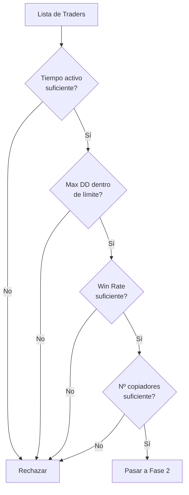

# 📐 Metodología de Selección de Traders

## 📋 Índice

1. [Introducción](#introducción)
2. [Perfiles de Riesgo](#perfiles-de-riesgo)
3. [Criterios de Selección](#criterios-de-selección)
4. [Métricas Clave](#métricas-clave)
5. [Sistema de Scoring](#sistema-de-scoring)
6. [Proceso de Evaluación](#proceso-de-evaluación)
7. [Límites y Controles](#límites-y-controles)
8. [Casos de Uso](#casos-de-uso)

---

## 🎯 Introducción

Esta metodología define un **framework cuantitativo y reproducible** para evaluar y seleccionar traders en Binance Copy Trading, con énfasis en:

- **Control de Riesgo**: Límites claros y medibles
- **Consistencia**: Criterios objetivos y estandarizados
- **Trazabilidad**: Decisiones documentadas y auditables
- **Adaptabilidad**: Ajuste según perfil del inversor

### Principios Fundamentales

1. **Risk-First Approach**: El control de riesgo precede al retorno
2. **Diversificación**: No más del 30% en un solo trader
3. **Consistencia sobre Volatilidad**: Preferir retornos estables
4. **Transparencia**: Métricas verificables y públicas
5. **Revisión Continua**: Monitoreo activo post-selección

---

## 🎚️ Perfiles de Riesgo

### Conservative (Conservador)

**Objetivo**: Preservación de capital con crecimiento moderado

| Criterio | Valor/Rango |
|----------|-------------|
| **ROI 90 días** | 10% - 30% |
| **Máx. Drawdown** | ≤ 10% |
| **Win Rate** | ≥ 60% |
| **Leverage Promedio** | 1× - 2× |
| **Tiempo Activo** | ≥ 180 días |
| **Nº Copiadores** | ≥ 200 |
| **Estilo Preferido** | Swing, Trend-Following |
| **Activos** | BTC, ETH (majors) |
| **Stop Copy** | -5% a -8% |
| **Daily Loss Cap** | -1% a -2% |

**Características**:
- ✅ Baja volatilidad
- ✅ Posiciones de largo plazo
- ✅ Apalancamiento mínimo
- ✅ Activos líquidos
- ❌ Evitar scalping
- ❌ Evitar altcoins de baja cap

**Asignación Sugerida**: 20-25% del portafolio por trader

---

### Moderate (Moderado)

**Objetivo**: Balance entre crecimiento y control de riesgo

| Criterio | Valor/Rango |
|----------|-------------|
| **ROI 90 días** | 20% - 60% |
| **Máx. Drawdown** | ≤ 20% |
| **Win Rate** | ≥ 55% |
| **Leverage Promedio** | 1× - 3× |
| **Tiempo Activo** | ≥ 90 días |
| **Nº Copiadores** | ≥ 100 |
| **Estilo Preferido** | Swing, Trend-Following |
| **Activos** | BTC, ETH, Top 20 |
| **Stop Copy** | -10% a -12% |
| **Daily Loss Cap** | -2% a -3% |

**Características**:
- ✅ Volatilidad controlada
- ✅ Mix de estrategias
- ✅ Apalancamiento moderado
- ✅ Diversificación de activos
- ⚠️ Scalping ocasional aceptable
- ⚠️ Altcoins con liquidez

**Asignación Sugerida**: 25-30% del portafolio por trader

---

### Aggressive (Agresivo)

**Objetivo**: Maximización de retornos con riesgo elevado

| Criterio | Valor/Rango |
|----------|-------------|
| **ROI 90 días** | 40% - 100%+ |
| **Máx. Drawdown** | ≤ 35% |
| **Win Rate** | ≥ 50% |
| **Leverage Promedio** | 2× - 5× |
| **Tiempo Activo** | ≥ 60 días |
| **Nº Copiadores** | ≥ 50 |
| **Estilo Preferido** | Scalping, Mixed |
| **Activos** | Cualquiera |
| **Stop Copy** | -15% a -20% |
| **Daily Loss Cap** | -5% a -7% |

**Características**:
- ⚠️ Alta volatilidad
- ⚠️ Operaciones frecuentes
- ⚠️ Apalancamiento alto
- ⚠️ Activos de alta beta
- ✅ Potencial de retornos altos
- ❌ No apto para capital crítico

**Asignación Sugerida**: 15-20% del portafolio por trader

---

## 🔍 Criterios de Selección

### Criterios Obligatorios (Hard Filters)

Estos criterios son **eliminatorios**. Un trader que no los cumple es automáticamente descartado.

#### 1. Tiempo Activo Mínimo

```
Conservative: ≥ 180 días
Moderate: ≥ 90 días
Aggressive: ≥ 60 días
```

**Rationale**: Evitar traders sin historial suficiente para evaluar consistencia.

#### 2. Máximo Drawdown

```
Conservative: ≤ 10%
Moderate: ≤ 20%
Aggressive: ≤ 35%
```

**Rationale**: Protección contra pérdidas catastróficas.

#### 3. Win Rate Mínimo

```
Conservative: ≥ 60%
Moderate: ≥ 55%
Aggressive: ≥ 50%
```

**Rationale**: Indicador de consistencia en la toma de decisiones.

#### 4. Número de Copiadores

```
Conservative: ≥ 200
Moderate: ≥ 100
Aggressive: ≥ 50
```

**Rationale**: Validación social y confianza de la comunidad.

---

### Criterios Preferenciales (Soft Filters)

Estos criterios son **deseables** pero no eliminatorios. Se usan para ranking y scoring.

#### 1. ROI Consistente

- ROI 30d, 90d, 180d en rango esperado
- Variación entre períodos < 50%
- Sin picos anómalos (posible manipulación)

#### 2. Leverage Controlado

- Promedio dentro del rango del perfil
- Sin spikes > 2× el promedio
- Tendencia estable o decreciente

#### 3. Diversificación de Activos

- Operar ≥ 3 pares diferentes
- No más del 70% en un solo activo
- Preferir majors (BTC, ETH)

#### 4. Estilo de Trading

- Alineado con perfil de riesgo
- Consistente en el tiempo
- Sin cambios bruscos de estrategia

#### 5. Transparencia

- Perfil público completo
- Historial de trades visible
- Sin gaps sospechosos en datos

---

## 📊 Métricas Clave

### Métricas Primarias (Disponibles en Binance)

#### 1. ROI (Return on Investment)

**Definición**: Retorno porcentual sobre capital invertido

```
ROI = (Valor Final - Valor Inicial) / Valor Inicial × 100
```

**Períodos**:
- ROI 7d: Muy corto plazo (volátil)
- ROI 30d: Corto plazo
- ROI 90d: **Métrica principal**
- ROI 180d: Largo plazo (si disponible)

**Interpretación**:
- ✅ ROI positivo y consistente
- ⚠️ ROI muy alto (posible riesgo oculto)
- ❌ ROI negativo o errático

#### 2. Maximum Drawdown (Max DD)

**Definición**: Máxima caída desde un pico hasta un valle

```
Max DD = (Pico - Valle) / Pico × 100
```

**Interpretación**:
- ✅ Max DD < 10%: Excelente control de riesgo
- ⚠️ Max DD 10-20%: Riesgo moderado
- ❌ Max DD > 20%: Alto riesgo

**Consideraciones**:
- Verificar si el DD fue recuperado
- Tiempo de recuperación (recovery time)
- Frecuencia de DDs significativos

#### 3. Win Rate

**Definición**: Porcentaje de trades ganadores

```
Win Rate = (Trades Ganadores / Total Trades) × 100
```

**Interpretación**:
- ✅ Win Rate > 60%: Muy bueno
- ⚠️ Win Rate 50-60%: Aceptable
- ❌ Win Rate < 50%: Cuestionable

**Nota**: Win Rate alto no garantiza rentabilidad (depende de R:R)

#### 4. Leverage Promedio

**Definición**: Apalancamiento medio utilizado

**Interpretación**:
- ✅ 1-2×: Conservador
- ⚠️ 2-3×: Moderado
- ❌ >3×: Agresivo

**Consideraciones**:
- Verificar variabilidad del leverage
- Correlación con volatilidad del mercado
- Uso de leverage en diferentes activos

#### 5. Número de Copiadores

**Definición**: Cantidad de usuarios copiando al trader

**Interpretación**:
- ✅ >500: Alta confianza
- ⚠️ 100-500: Confianza moderada
- ❌ <100: Baja validación social

**Limitaciones**:
- No indica calidad (puede ser marketing)
- Puede cambiar rápidamente
- Verificar tendencia (creciente/decreciente)

---

### Métricas Derivadas (Calculadas)

#### 1. Risk-Adjusted Return (RAR)

**Definición**: Retorno ajustado por riesgo (similar a Sharpe Ratio)

```
RAR = (ROI 90d - Risk-Free Rate) / Max DD
```

**Ejemplo**:
```
Trader A: ROI 90d = 40%, Max DD = 15%
RAR = (40 - 0) / 15 = 2.67

Trader B: ROI 90d = 60%, Max DD = 30%
RAR = (60 - 0) / 30 = 2.00

→ Trader A es mejor (mayor retorno por unidad de riesgo)
```

**Interpretación**:
- ✅ RAR > 3: Excelente
- ⚠️ RAR 2-3: Bueno
- ❌ RAR < 2: Cuestionable

#### 2. Consistency Score

**Definición**: Medida de estabilidad de retornos

```
Consistency = 1 - (StdDev(ROI 7d, 30d, 90d) / Mean(ROI 7d, 30d, 90d))
```

**Interpretación**:
- ✅ Consistency > 0.8: Muy consistente
- ⚠️ Consistency 0.6-0.8: Moderadamente consistente
- ❌ Consistency < 0.6: Errático

#### 3. Recovery Factor

**Definición**: Capacidad de recuperación post-drawdown

```
Recovery Factor = ROI Total / Max DD
```

**Interpretación**:
- ✅ RF > 5: Excelente recuperación
- ⚠️ RF 3-5: Buena recuperación
- ❌ RF < 3: Recuperación lenta

#### 4. Profit Factor

**Definición**: Ratio de ganancias vs pérdidas

```
Profit Factor = Suma(Ganancias) / Suma(Pérdidas)
```

**Interpretación**:
- ✅ PF > 2: Excelente
- ⚠️ PF 1.5-2: Bueno
- ❌ PF < 1.5: Cuestionable

**Nota**: Requiere acceso a historial de trades individual

---

## 🏆 Sistema de Scoring

### Modelo de Puntuación Ponderada

Cada trader recibe un **score de 0 a 100** basado en múltiples factores.

#### Pesos por Perfil

| Métrica | Conservative | Moderate | Aggressive |
|---------|--------------|----------|------------|
| Max Drawdown | 30% | 25% | 20% |
| Win Rate | 25% | 20% | 15% |
| ROI 90d | 15% | 25% | 30% |
| Consistency | 20% | 15% | 10% |
| RAR | 10% | 15% | 25% |

#### Fórmula de Scoring

```python
def calculate_score(trader, profile):
    weights = WEIGHTS[profile]
    
    # Normalizar métricas a escala 0-100
    dd_score = normalize_drawdown(trader.max_dd, profile)
    wr_score = normalize_win_rate(trader.win_rate, profile)
    roi_score = normalize_roi(trader.roi_90d, profile)
    cons_score = trader.consistency_score * 100
    rar_score = normalize_rar(trader.rar, profile)
    
    # Calcular score ponderado
    total_score = (
        dd_score * weights['max_dd'] +
        wr_score * weights['win_rate'] +
        roi_score * weights['roi'] +
        cons_score * weights['consistency'] +
        rar_score * weights['rar']
    )
    
    return round(total_score, 2)
```

#### Interpretación de Scores

| Score | Clasificación | Acción |
|-------|---------------|--------|
| 85-100 | Excelente | Aprobación inmediata |
| 70-84 | Bueno | Aprobación con revisión |
| 55-69 | Aceptable | Revisión detallada requerida |
| 40-54 | Marginal | Rechazar o monitorear |
| 0-39 | Pobre | Rechazar |

---

## 🔄 Proceso de Evaluación

### Fase 1: Filtrado Inicial



**Output**: Lista reducida de candidatos (típicamente 10-20)

---

### Fase 2: Análisis Cuantitativo

1. **Captura de Métricas**
   - ROI 30d, 90d, 180d
   - Max DD histórico
   - Win Rate
   - Leverage promedio
   - Nº de copiadores

2. **Cálculo de Métricas Derivadas**
   - Risk-Adjusted Return
   - Consistency Score
   - Recovery Factor
   - Profit Factor (si disponible)

3. **Scoring**
   - Aplicar modelo de puntuación
   - Generar ranking
   - Identificar top 5-10

**Output**: Ranking cuantitativo con scores

---

### Fase 3: Análisis Cualitativo

1. **Revisión de Perfil**
   - Estilo de trading declarado
   - Activos operados
   - Frecuencia de operaciones
   - Comentarios y actualizaciones

2. **Análisis de Historial**
   - Consistencia de estrategia
   - Cambios significativos
   - Eventos anómalos
   - Períodos de inactividad

3. **Validación Social**
   - Comentarios de copiadores
   - Reputación en comunidad
   - Transparencia y comunicación

**Output**: Evaluación cualitativa documentada

---

### Fase 4: Decisión Final

1. **Consolidación**
   - Combinar análisis cuantitativo y cualitativo
   - Verificar alineación con perfil de riesgo
   - Evaluar diversificación del portafolio

2. **Documentación**
   - Completar template de evaluación
   - Generar JSON estandarizado
   - Justificar decisión

3. **Aprobación**
   - Revisión por stakeholder
   - Firma de aprobación
   - Commit a repositorio

**Output**: Evaluación completa y aprobada

---

## 🛡️ Límites y Controles

### Límites por Trader

| Parámetro | Conservative | Moderate | Aggressive |
|-----------|--------------|----------|------------|
| **Asignación Máxima** | 25% | 30% | 20% |
| **Stop Copy (DD)** | -5% a -8% | -10% a -12% | -15% a -20% |
| **Daily Loss Cap** | -1% a -2% | -2% a -3% | -5% a -7% |
| **Max Leverage** | 2× | 3× | 5× |

### Límites de Portafolio

- **Máximo de Traders**: 5-7 simultáneos
- **Diversificación**: No más de 2 traders con mismo estilo
- **Exposición Total**: No exceder 100% del capital
- **Reserva de Liquidez**: Mantener 10-20% sin asignar

### Triggers de Revisión

**Revisión Inmediata** si:
- DD del trader > 80% del límite de stop copy
- Cambio brusco de estrategia
- Leverage > 150% del promedio histórico
- ROI 7d < -10%
- Pérdida de >50% de copiadores en 7 días

**Revisión Semanal**:
- Performance vs benchmark
- Cumplimiento de límites
- Actualización de métricas

**Revisión Mensual**:
- Re-evaluación completa
- Ajuste de asignaciones
- Decisión de continuidad

---

## 📚 Casos de Uso

### Caso 1: Selección Inicial (Portfolio Vacío)

**Contexto**: Inversor con $10,000 USDT, perfil moderado

**Proceso**:
1. Filtrar traders con criterios moderados
2. Seleccionar top 5 por score
3. Diversificar por estilo y activos
4. Asignar 20% a cada trader ($2,000)
5. Mantener 20% en reserva ($2,000)

**Resultado**:
- Trader A (Swing, BTC/ETH): $2,000
- Trader B (Trend, BTC/ETH/BNB): $2,000
- Trader C (Swing, ETH/SOL): $2,000
- Trader D (Mixed, BTC/MATIC): $2,000
- Trader E (Trend, BTC/AVAX): $2,000
- Reserva: $2,000

---

### Caso 2: Reemplazo de Trader Underperforming

**Contexto**: Trader C ha tenido DD de -11% (límite: -12%)

**Proceso**:
1. Activar revisión inmediata
2. Analizar causas del DD
3. Evaluar si es temporal o estructural
4. Decisión:
   - **Mantener**: Si es temporal y trader tiene historial sólido
   - **Reducir**: Bajar asignación de 20% a 10%
   - **Cerrar**: Si supera límite o cambió estrategia

**Resultado**: Cerrar posición, buscar reemplazo con mismo perfil

---

### Caso 3: Escalado de Portafolio

**Contexto**: Portfolio de $10K creció a $15K, agregar capital

**Proceso**:
1. Re-evaluar traders actuales
2. Verificar que siguen cumpliendo criterios
3. Opciones:
   - **Proporcional**: Aumentar todos por igual
   - **Selectivo**: Solo los de mejor performance
   - **Nuevo**: Agregar 6to trader

**Resultado**: Aumentar top 3 performers, mantener otros, agregar reserva

---

## 🎓 Conclusiones

### Mejores Prácticas

1. ✅ **Seguir el Proceso**: No saltarse fases de evaluación
2. ✅ **Documentar Todo**: Cada decisión debe estar justificada
3. ✅ **Diversificar**: No poner todos los huevos en una canasta
4. ✅ **Monitorear Activamente**: Revisión continua es clave
5. ✅ **Respetar Límites**: Los stop-loss existen por algo

### Errores Comunes a Evitar

1. ❌ **FOMO**: No copiar por ROI alto sin análisis
2. ❌ **Overtrading**: No cambiar traders constantemente
3. ❌ **Overallocation**: No exceder límites por trader
4. ❌ **Ignorar Señales**: No ignorar triggers de revisión
5. ❌ **Falta de Diversificación**: No concentrar en un estilo

### Próximos Pasos

1. Aplicar esta metodología consistentemente
2. Iterar y mejorar basado en resultados
3. Documentar lecciones aprendidas
4. Compartir conocimiento con la comunidad

---

**Última actualización**: 2025-01-08  
**Versión**: 1.0.0  
**Autor**: Arquitecto de Soluciones - Akira Traders