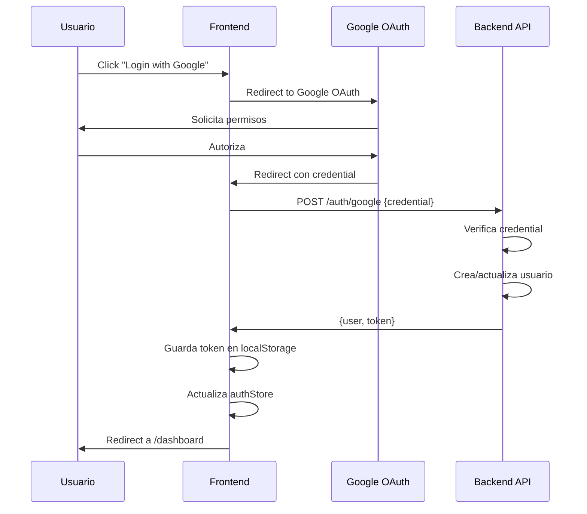

# 🏗️ Arquitectura Frontend - Akira Traders

## 📋 Índice

1. [Visión General](#visión-general)
2. [Stack Tecnológico](#stack-tecnológico)
3. [Arquitectura de Componentes](#arquitectura-de-componentes)
4. [Gestión de Estado](#gestión-de-estado)
5. [Routing y Navegación](#routing-y-navegación)
6. [Autenticación y Seguridad](#autenticación-y-seguridad)
7. [API y Servicios](#api-y-servicios)
8. [Optimización y Performance](#optimización-y-performance)

---

## 🎯 Visión General

### Principios de Diseño

1. **Component-Driven Development**: Componentes reutilizables y modulares
2. **Type Safety First**: TypeScript estricto en todo el código
3. **Performance Optimized**: Code splitting, lazy loading, memoization
4. **Accessibility**: WCAG 2.1 AA compliance
5. **Mobile First**: Diseño responsive desde el inicio
6. **Dark Mode Native**: Soporte nativo de tema oscuro/claro

### Arquitectura General

```
┌─────────────────────────────────────────────────────────────┐
│                      PRESENTACIÓN                            │
│  ┌──────────────┐  ┌──────────────┐  ┌──────────────┐      │
│  │   Pages      │  │  Components  │  │   Layouts    │      │
│  └──────────────┘  └──────────────┘  └──────────────┘      │
└─────────────────────────────────────────────────────────────┘
                            ↓
┌─────────────────────────────────────────────────────────────┐
│                      LÓGICA DE NEGOCIO                       │
│  ┌──────────────┐  ┌──────────────┐  ┌──────────────┐      │
│  │    Hooks     │  │    Store     │  │   Services   │      │
│  └──────────────┘  └──────────────┘  └──────────────┘      │
└─────────────────────────────────────────────────────────────┘
                            ↓
┌─────────────────────────────────────────────────────────────┐
│                      CAPA DE DATOS                           │
│  ┌──────────────┐  ┌──────────────┐  ┌──────────────┐      │
│  │  React Query │  │     API      │  │   Storage    │      │
│  └──────────────┘  └──────────────┘  └──────────────┘      │
└─────────────────────────────────────────────────────────────┘
```

---

## 🛠️ Stack Tecnológico

### Core Framework

```typescript
{
  "react": "^18.2.0",           // UI Library
  "react-dom": "^18.2.0",       // DOM Renderer
  "typescript": "^5.3.0",       // Type Safety
  "vite": "^5.0.0"              // Build Tool
}
```

**Justificación**:
- **React 18**: Concurrent features, automatic batching, Suspense
- **TypeScript**: Type safety, mejor DX, menos bugs en producción
- **Vite**: Build ultra-rápido, HMR instantáneo, mejor DX

### Routing

```typescript
{
  "react-router-dom": "^6.20.0"
}
```

**Características**:
- Nested routes
- Lazy loading de rutas
- Protected routes
- Route-based code splitting

### Estado Global

```typescript
{
  "zustand": "^4.4.7",                    // Estado global ligero
  "@tanstack/react-query": "^5.14.0"     // Server state management
}
```

**Justificación**:
- **Zustand**: Simple, sin boilerplate, TypeScript-first
- **React Query**: Cache automático, refetch, optimistic updates

### UI y Estilos

```typescript
{
  "tailwindcss": "^3.4.0",          // Utility-first CSS
  "@headlessui/react": "^1.7.17",   // Componentes accesibles
  "@heroicons/react": "^2.1.0",     // Iconos
  "framer-motion": "^10.16.0",      // Animaciones
  "clsx": "^2.0.0",                 // Conditional classes
  "tailwind-merge": "^2.2.0"        // Merge Tailwind classes
}
```

### Formularios y Validación

```typescript
{
  "react-hook-form": "^7.49.0",     // Formularios performantes
  "@hookform/resolvers": "^3.3.0",  // Resolvers para validación
  "zod": "^3.22.0"                  // Schema validation
}
```

### Gráficos y Visualización

```typescript
{
  "recharts": "^2.10.0",            // Gráficos React-native
  "chart.js": "^4.4.0",             // Gráficos canvas
  "react-chartjs-2": "^5.2.0"       // Wrapper React para Chart.js
}
```

### Autenticación

```typescript
{
  "@react-oauth/google": "^0.12.0", // Google OAuth
  "jwt-decode": "^4.0.0"            // Decodificar JWT
}
```

### HTTP Client

```typescript
{
  "axios": "^1.6.0"                 // HTTP client
}
```

### Utilidades

```typescript
{
  "date-fns": "^3.0.0",             // Manejo de fechas
  "lodash-es": "^4.17.21",          // Utilidades JS
  "react-hot-toast": "^2.4.1"       // Notificaciones
}
```

---

## 🧩 Arquitectura de Componentes

### Jerarquía de Componentes

```
App
├── Providers (Auth, Theme, Query)
│   └── Router
│       ├── PublicLayout
│       │   ├── Header
│       │   ├── Hero
│       │   └── Footer
│       │
│       └── PrivateLayout (Protected)
│           ├── Sidebar
│           ├── Header
│           │   ├── UserMenu
│           │   ├── Notifications
│           │   └── ThemeToggle
│           │
│           ├── MainContent
│           │   └── Pages
│           │       ├── Dashboard
│           │       │   ├── StatsCards
│           │       │   ├── PerformanceChart
│           │       │   └── TopTraders
│           │       │
│           │       ├── Traders
│           │       │   ├── TraderFilters
│           │       │   ├── TraderList
│           │       │   │   └── TraderCard
│           │       │   └── TraderTable
│           │       │
│           │       └── TraderDetail
│           │           ├── TraderHeader
│           │           ├── MetricsGrid
│           │           ├── PerformanceCharts
│           │           └── EvaluationHistory
│           │
│           └── Footer
```

### Tipos de Componentes

#### 1. Componentes de Presentación (Dumb Components)

**Características**:
- Solo reciben props
- No tienen estado interno (excepto UI state)
- No acceden a servicios o stores
- Altamente reutilizables

**Ejemplo**:

```tsx
// src/components/common/Button/Button.tsx
interface ButtonProps {
  variant?: 'primary' | 'secondary' | 'danger' | 'ghost';
  size?: 'sm' | 'md' | 'lg';
  children: React.ReactNode;
  onClick?: () => void;
  disabled?: boolean;
  loading?: boolean;
}

export function Button({
  variant = 'primary',
  size = 'md',
  children,
  onClick,
  disabled,
  loading,
}: ButtonProps) {
  const baseClasses = 'rounded-lg font-medium transition-all';
  
  const variantClasses = {
    primary: 'bg-primary hover:bg-primary-dark text-black',
    secondary: 'bg-bg-secondary hover:bg-bg-tertiary text-text-primary',
    danger: 'bg-danger hover:bg-danger/90 text-white',
    ghost: 'bg-transparent hover:bg-bg-secondary text-text-primary',
  };
  
  const sizeClasses = {
    sm: 'px-3 py-1.5 text-sm',
    md: 'px-4 py-2 text-base',
    lg: 'px-6 py-3 text-lg',
  };
  
  return (
    <button
      className={cn(
        baseClasses,
        variantClasses[variant],
        sizeClasses[size],
        disabled && 'opacity-50 cursor-not-allowed'
      )}
      onClick={onClick}
      disabled={disabled || loading}
    >
      {loading ? <Spinner size="sm" /> : children}
    </button>
  );
}
```

#### 2. Componentes Contenedores (Smart Components)

**Características**:
- Manejan lógica de negocio
- Acceden a stores y servicios
- Pasan datos a componentes de presentación
- Manejan side effects

**Ejemplo**:

```tsx
// src/components/traders/TraderList/TraderListContainer.tsx
export function TraderListContainer() {
  const { traders, isLoading, error } = useTraders();
  const { filters, setFilters } = useTraderFilters();
  
  const filteredTraders = useMemo(() => {
    return traders.filter(trader => {
      if (filters.profile && trader.risk_profile !== filters.profile) {
        return false;
      }
      if (filters.minScore && trader.score < filters.minScore) {
        return false;
      }
      return true;
    });
  }, [traders, filters]);
  
  if (isLoading) return <LoadingSpinner />;
  if (error) return <ErrorMessage error={error} />;
  
  return (
    <TraderList
      traders={filteredTraders}
      filters={filters}
      onFilterChange={setFilters}
    />
  );
}
```

#### 3. Componentes de Layout

**Características**:
- Definen estructura de la página
- Manejan responsive design
- Proporcionan contexto a children

**Ejemplo**:

```tsx
// src/components/layout/MainLayout/MainLayout.tsx
export function MainLayout({ children }: { children: React.ReactNode }) {
  const [sidebarOpen, setSidebarOpen] = useState(true);
  
  return (
    <div className="flex h-screen bg-bg-primary">
      <Sidebar isOpen={sidebarOpen} onToggle={setSidebarOpen} />
      
      <div className="flex-1 flex flex-col overflow-hidden">
        <Header onMenuClick={() => setSidebarOpen(!sidebarOpen)} />
        
        <main className="flex-1 overflow-y-auto p-6">
          {children}
        </main>
        
        <Footer />
      </div>
    </div>
  );
}
```

### Patrón de Composición

```tsx
// Componente compuesto con subcomponentes
export function Card({ children, className }: CardProps) {
  return (
    <div className={cn('bg-bg-secondary rounded-lg', className)}>
      {children}
    </div>
  );
}

Card.Header = function CardHeader({ children }: { children: React.ReactNode }) {
  return <div className="p-4 border-b border-border">{children}</div>;
};

Card.Title = function CardTitle({ children }: { children: React.ReactNode }) {
  return <h3 className="text-lg font-semibold text-text-primary">{children}</h3>;
};

Card.Body = function CardBody({ children }: { children: React.ReactNode }) {
  return <div className="p-4">{children}</div>;
};

// Uso
<Card>
  <Card.Header>
    <Card.Title>Trader Performance</Card.Title>
  </Card.Header>
  <Card.Body>
    {/* Contenido */}
  </Card.Body>
</Card>
```

---

## 🗄️ Gestión de Estado

### Arquitectura de Estado

```
┌─────────────────────────────────────────────────────────────┐
│                      CLIENT STATE                            │
│  ┌──────────────┐  ┌──────────────┐  ┌──────────────┐      │
│  │  UI State    │  │  Auth State  │  │ Theme State  │      │
│  │  (Zustand)   │  │  (Zustand)   │  │  (Zustand)   │      │
│  └──────────────┘  └──────────────┘  └──────────────┘      │
└─────────────────────────────────────────────────────────────┘
                            ↓
┌─────────────────────────────────────────────────────────────┐
│                      SERVER STATE                            │
│  ┌──────────────┐  ┌──────────────┐  ┌──────────────┐      │
│  │   Traders    │  │ Evaluations  │  │  Analytics   │      │
│  │(React Query) │  │(React Query) │  │(React Query) │      │
│  └──────────────┘  └──────────────┘  └──────────────┘      │
└─────────────────────────────────────────────────────────────┘
```

### Zustand Stores

#### Auth Store

```typescript
// src/store/authStore.ts
interface User {
  id: string;
  email: string;
  name: string;
  picture: string;
}

interface AuthState {
  user: User | null;
  token: string | null;
  isAuthenticated: boolean;
  isLoading: boolean;
  
  // Actions
  setUser: (user: User) => void;
  setToken: (token: string) => void;
  logout: () => void;
  checkAuth: () => Promise<void>;
}

export const useAuthStore = create<AuthState>((set, get) => ({
  user: null,
  token: localStorage.getItem('token'),
  isAuthenticated: false,
  isLoading: true,
  
  setUser: (user) => set({ user, isAuthenticated: true }),
  
  setToken: (token) => {
    localStorage.setItem('token', token);
    set({ token });
  },
  
  logout: () => {
    localStorage.removeItem('token');
    set({ user: null, token: null, isAuthenticated: false });
  },
  
  checkAuth: async () => {
    const token = get().token;
    if (!token) {
      set({ isLoading: false });
      return;
    }
    
    try {
      const user = await authService.verifyToken(token);
      set({ user, isAuthenticated: true, isLoading: false });
    } catch (error) {
      get().logout();
      set({ isLoading: false });
    }
  },
}));
```

#### Theme Store

```typescript
// src/store/themeStore.ts
type Theme = 'light' | 'dark' | 'system';

interface ThemeState {
  theme: Theme;
  resolvedTheme: 'light' | 'dark';
  
  setTheme: (theme: Theme) => void;
  toggleTheme: () => void;
}

export const useThemeStore = create<ThemeState>((set, get) => ({
  theme: (localStorage.getItem('theme') as Theme) || 'system',
  resolvedTheme: 'dark',
  
  setTheme: (theme) => {
    localStorage.setItem('theme', theme);
    set({ theme });
    
    // Aplicar tema al DOM
    const resolved = theme === 'system' 
      ? window.matchMedia('(prefers-color-scheme: dark)').matches ? 'dark' : 'light'
      : theme;
    
    document.documentElement.classList.toggle('dark', resolved === 'dark');
    set({ resolvedTheme: resolved });
  },
  
  toggleTheme: () => {
    const current = get().theme;
    const next = current === 'dark' ? 'light' : 'dark';
    get().setTheme(next);
  },
}));
```

### React Query

#### Configuración

```typescript
// src/config/queryClient.ts
import { QueryClient } from '@tanstack/react-query';

export const queryClient = new QueryClient({
  defaultOptions: {
    queries: {
      staleTime: 5 * 60 * 1000, // 5 minutos
      cacheTime: 10 * 60 * 1000, // 10 minutos
      retry: 3,
      refetchOnWindowFocus: false,
    },
  },
});
```

#### Custom Hooks

```typescript
// src/hooks/useTraders.ts
export function useTraders(filters?: TraderFilters) {
  return useQuery({
    queryKey: ['traders', filters],
    queryFn: () => tradersApi.getAll(filters),
    select: (data) => data.traders,
  });
}

export function useTrader(id: string) {
  return useQuery({
    queryKey: ['trader', id],
    queryFn: () => tradersApi.getById(id),
    enabled: !!id,
  });
}

export function useCreateTrader() {
  const queryClient = useQueryClient();
  
  return useMutation({
    mutationFn: tradersApi.create,
    onSuccess: () => {
      queryClient.invalidateQueries({ queryKey: ['traders'] });
      toast.success('Trader creado exitosamente');
    },
    onError: (error) => {
      toast.error('Error al crear trader');
    },
  });
}
```

---

## 🛣️ Routing y Navegación

### Estructura de Rutas

```typescript
// src/config/routes.tsx
export const routes = {
  // Públicas
  home: '/',
  login: '/login',
  
  // Privadas
  dashboard: '/dashboard',
  traders: '/traders',
  traderDetail: '/traders/:id',
  newEvaluation: '/evaluations/new',
  editEvaluation: '/evaluations/:id/edit',
  portfolio: '/portfolio',
  analytics: '/analytics',
  settings: '/settings',
} as const;
```

### Router Configuration

```tsx
// src/App.tsx
import { BrowserRouter, Routes, Route } from 'react-router-dom';

function App() {
  return (
    <BrowserRouter>
      <Routes>
        {/* Rutas públicas */}
        <Route element={<PublicLayout />}>
          <Route path="/" element={<HomePage />} />
          <Route path="/login" element={<LoginPage />} />
        </Route>
        
        {/* Rutas privadas */}
        <Route element={<ProtectedRoute />}>
          <Route element={<MainLayout />}>
            <Route path="/dashboard" element={<DashboardPage />} />
            <Route path="/traders" element={<TradersPage />} />
            <Route path="/traders/:id" element={<TraderDetailPage />} />
            <Route path="/evaluations/new" element={<NewEvaluationPage />} />
            <Route path="/portfolio" element={<PortfolioPage />} />
            <Route path="/analytics" element={<AnalyticsPage />} />
            <Route path="/settings" element={<SettingsPage />} />
          </Route>
        </Route>
        
        {/* 404 */}
        <Route path="*" element={<NotFoundPage />} />
      </Routes>
    </BrowserRouter>
  );
}
```

### Protected Route

```tsx
// src/components/auth/ProtectedRoute.tsx
export function ProtectedRoute() {
  const { isAuthenticated, isLoading } = useAuthStore();
  const location = useLocation();
  
  if (isLoading) {
    return <LoadingScreen />;
  }
  
  if (!isAuthenticated) {
    return <Navigate to="/login" state={{ from: location }} replace />;
  }
  
  return <Outlet />;
}
```

---

## 🔐 Autenticación y Seguridad

### Flujo de Autenticación



### Implementación

```typescript
// src/services/auth/google.ts
export const googleAuthService = {
  async loginWithGoogle(credential: string) {
    const response = await api.post('/auth/google', { credential });
    return response.data;
  },
  
  async verifyToken(token: string) {
    const response = await api.get('/auth/verify', {
      headers: { Authorization: `Bearer ${token}` },
    });
    return response.data.user;
  },
  
  async refreshToken(token: string) {
    const response = await api.post('/auth/refresh', { token });
    return response.data.token;
  },
};
```

### Axios Interceptors

```typescript
// src/services/api/axios.ts
import axios from 'axios';

export const api = axios.create({
  baseURL: import.meta.env.VITE_API_URL,
  timeout: 30000,
});

// Request interceptor
api.interceptors.request.use(
  (config) => {
    const token = useAuthStore.getState().token;
    if (token) {
      config.headers.Authorization = `Bearer ${token}`;
    }
    return config;
  },
  (error) => Promise.reject(error)
);

// Response interceptor
api.interceptors.response.use(
  (response) => response,
  async (error) => {
    const originalRequest = error.config;
    
    // Si es 401 y no es retry, intentar refresh
    if (error.response?.status === 401 && !originalRequest._retry) {
      originalRequest._retry = true;
      
      try {
        const token = useAuthStore.getState().token;
        const newToken = await googleAuthService.refreshToken(token!);
        useAuthStore.getState().setToken(newToken);
        
        originalRequest.headers.Authorization = `Bearer ${newToken}`;
        return api(originalRequest);
      } catch (refreshError) {
        useAuthStore.getState().logout();
        window.location.href = '/login';
        return Promise.reject(refreshError);
      }
    }
    
    return Promise.reject(error);
  }
);
```

---

## 📡 API y Servicios

### Estructura de Servicios

```typescript
// src/services/api/traders.ts
export const tradersApi = {
  async getAll(filters?: TraderFilters) {
    const response = await api.get('/traders', { params: filters });
    return response.data;
  },
  
  async getById(id: string) {
    const response = await api.get(`/traders/${id}`);
    return response.data;
  },
  
  async create(data: CreateTraderDto) {
    const response = await api.post('/traders', data);
    return response.data;
  },
  
  async update(id: string, data: UpdateTraderDto) {
    const response = await api.put(`/traders/${id}`, data);
    return response.data;
  },
  
  async delete(id: string) {
    const response = await api.delete(`/traders/${id}`);
    return response.data;
  },
};
```

---

## ⚡ Optimización y Performance

### Code Splitting

```tsx
// Lazy loading de páginas
const DashboardPage = lazy(() => import('@/pages/Dashboard'));
const TradersPage = lazy(() => import('@/pages/Traders'));

// Uso con Suspense
<Suspense fallback={<LoadingScreen />}>
  <Routes>
    <Route path="/dashboard" element={<DashboardPage />} />
    <Route path="/traders" element={<TradersPage />} />
  </Routes>
</Suspense>
```

### Memoization

```tsx
// useMemo para cálculos costosos
const filteredTraders = useMemo(() => {
  return traders.filter(/* ... */);
}, [traders, filters]);

// useCallback para funciones
const handleFilterChange = useCallback((newFilters) => {
  setFilters(newFilters);
}, []);

// React.memo para componentes
export const TraderCard = memo(function TraderCard({ trader }: Props) {
  // ...
});
```

### Virtual Scrolling

```tsx
// Para listas largas
import { useVirtualizer } from '@tanstack/react-virtual';

function TraderList({ traders }: Props) {
  const parentRef = useRef<HTMLDivElement>(null);
  
  const virtualizer = useVirtualizer({
    count: traders.length,
    getScrollElement: () => parentRef.current,
    estimateSize: () => 100,
  });
  
  return (
    <div ref={parentRef} className="h-screen overflow-auto">
      <div style={{ height: `${virtualizer.getTotalSize()}px` }}>
        {virtualizer.getVirtualItems().map((virtualRow) => (
          <div
            key={virtualRow.index}
            style={{
              position: 'absolute',
              top: 0,
              left: 0,
              width: '100%',
              height: `${virtualRow.size}px`,
              transform: `translateY(${virtualRow.start}px)`,
            }}
          >
            <TraderCard trader={traders[virtualRow.index]} />
          </div>
        ))}
      </div>
    </div>
  );
}
```

---

## 📚 Referencias

- [React Best Practices](https://react.dev/learn)
- [TypeScript Handbook](https://www.typescriptlang.org/docs/)
- [Zustand Documentation](https://docs.pmnd.rs/zustand)
- [TanStack Query](https://tanstack.com/query/latest)
- [Tailwind CSS](https://tailwindcss.com/docs)

---

**Última actualización**: 2025-01-08  
**Versión**: 1.0.0  
**Autor**: Akira Traders Team