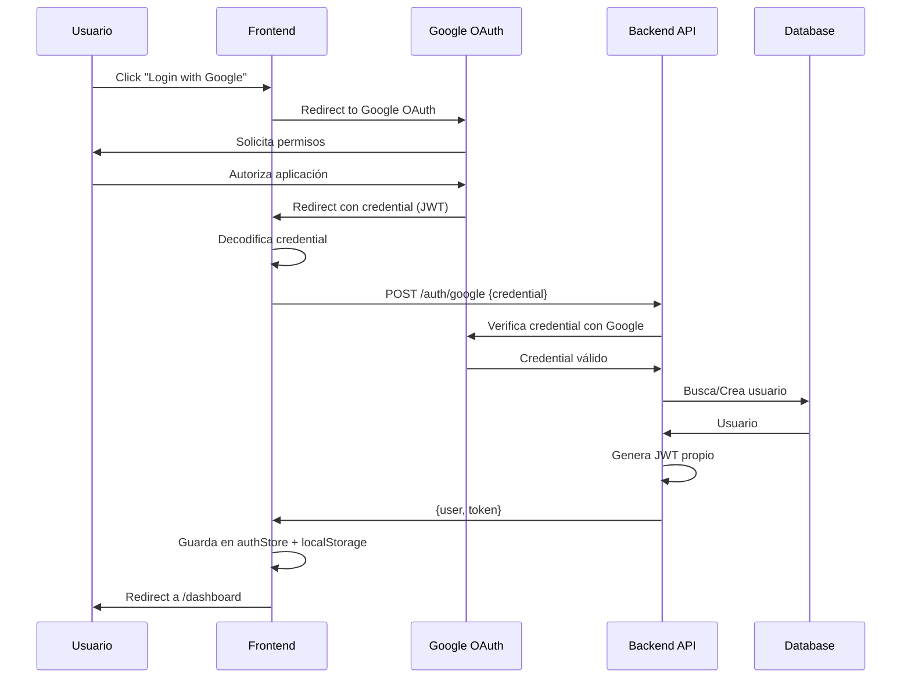

# 🔐 Guía de Autenticación con Google OAuth - Akira Traders

## 📋 Índice

1. [Configuración de Google Cloud](#configuración-de-google-cloud)
2. [Implementación Frontend](#implementación-frontend)
3. [Flujo de Autenticación](#flujo-de-autenticación)
4. [Gestión de Sesiones](#gestión-de-sesiones)
5. [Seguridad](#seguridad)
6. [Troubleshooting](#troubleshooting)

---

## ☁️ Configuración de Google Cloud

### Paso 1: Crear Proyecto en Google Cloud Console

1. **Acceder a Google Cloud Console**
   - Ir a https://console.cloud.google.com
   - Iniciar sesión con tu cuenta de Google

2. **Crear Nuevo Proyecto**
   ```
   1. Click en el selector de proyectos (arriba a la izquierda)
   2. Click en "Nuevo Proyecto"
   3. Nombre: "Akira Traders"
   4. Organización: (opcional)
   5. Click en "Crear"
   ```

3. **Seleccionar el Proyecto**
   - Asegúrate de que "Akira Traders" esté seleccionado en el selector de proyectos

### Paso 2: Habilitar Google+ API

1. **Ir a APIs & Services**
   ```
   Menú ☰ → APIs & Services → Library
   ```

2. **Buscar y Habilitar**
   ```
   1. Buscar "Google+ API"
   2. Click en "Google+ API"
   3. Click en "Habilitar"
   ```

### Paso 3: Crear Credenciales OAuth 2.0

1. **Ir a Credenciales**
   ```
   APIs & Services → Credentials
   ```

2. **Configurar Pantalla de Consentimiento**
   ```
   1. Click en "Configurar pantalla de consentimiento"
   2. Tipo de usuario: "Externo"
   3. Click en "Crear"
   
   Información de la aplicación:
   - Nombre: "Akira Traders"
   - Email de asistencia: tu-email@gmail.com
   - Logo: (opcional)
   
   Dominios autorizados:
   - localhost (para desarrollo)
   - tu-dominio.com (para producción)
   
   Información de contacto del desarrollador:
   - Email: tu-email@gmail.com
   
   4. Click en "Guardar y continuar"
   5. Ámbitos: No agregar ninguno (usar predeterminados)
   6. Click en "Guardar y continuar"
   7. Usuarios de prueba: Agregar tu email
   8. Click en "Guardar y continuar"
   ```

3. **Crear Credenciales OAuth**
   ```
   1. Click en "Crear credenciales"
   2. Seleccionar "ID de cliente de OAuth"
   3. Tipo de aplicación: "Aplicación web"
   4. Nombre: "Akira Traders Web Client"
   
   Orígenes de JavaScript autorizados:
   - http://localhost:5173 (desarrollo)
   - http://localhost:3000 (desarrollo alternativo)
   - https://tu-dominio.com (producción)
   
   URIs de redireccionamiento autorizados:
   - http://localhost:5173/auth/callback (desarrollo)
   - https://tu-dominio.com/auth/callback (producción)
   
   5. Click en "Crear"
   ```

4. **Copiar Credenciales**
   ```
   Se mostrará un modal con:
   - Client ID: 123456789-abc.apps.googleusercontent.com
   - Client Secret: GOCSPX-xxxxxxxxxxxxx
   
   ⚠️ IMPORTANTE: Guarda estas credenciales de forma segura
   ```

### Paso 4: Configurar Variables de Entorno

Crear archivo `.env.local` en el directorio `frontend/`:

```env
# Google OAuth
VITE_GOOGLE_CLIENT_ID=123456789-abc.apps.googleusercontent.com
VITE_GOOGLE_REDIRECT_URI=http://localhost:5173/auth/callback

# API Backend
VITE_API_URL=http://localhost:3000/api
```

---

## 💻 Implementación Frontend

### Instalación de Dependencias

```bash
npm install @react-oauth/google jwt-decode
```

### Configuración del Provider

```tsx
// src/main.tsx
import { GoogleOAuthProvider } from '@react-oauth/google';

const clientId = import.meta.env.VITE_GOOGLE_CLIENT_ID;

ReactDOM.createRoot(document.getElementById('root')!).render(
  <React.StrictMode>
    <GoogleOAuthProvider clientId={clientId}>
      <App />
    </GoogleOAuthProvider>
  </React.StrictMode>
);
```

### Store de Autenticación

```typescript
// src/store/authStore.ts
import { create } from 'zustand';
import { persist } from 'zustand/middleware';
import { jwtDecode } from 'jwt-decode';

interface User {
  id: string;
  email: string;
  name: string;
  picture: string;
  email_verified: boolean;
}

interface AuthState {
  user: User | null;
  token: string | null;
  isAuthenticated: boolean;
  isLoading: boolean;
  
  // Actions
  loginWithGoogle: (credential: string) => Promise<void>;
  logout: () => void;
  checkAuth: () => Promise<void>;
  refreshToken: () => Promise<void>;
}

export const useAuthStore = create<AuthState>()(
  persist(
    (set, get) => ({
      user: null,
      token: null,
      isAuthenticated: false,
      isLoading: true,
      
      loginWithGoogle: async (credential: string) => {
        try {
          // Decodificar el token de Google
          const decoded = jwtDecode<any>(credential);
          
          // Enviar al backend para validación y obtener JWT propio
          const response = await fetch(`${import.meta.env.VITE_API_URL}/auth/google`, {
            method: 'POST',
            headers: { 'Content-Type': 'application/json' },
            body: JSON.stringify({ credential }),
          });
          
          if (!response.ok) {
            throw new Error('Authentication failed');
          }
          
          const data = await response.json();
          
          set({
            user: data.user,
            token: data.token,
            isAuthenticated: true,
            isLoading: false,
          });
        } catch (error) {
          console.error('Login error:', error);
          throw error;
        }
      },
      
      logout: () => {
        set({
          user: null,
          token: null,
          isAuthenticated: false,
        });
      },
      
      checkAuth: async () => {
        const token = get().token;
        
        if (!token) {
          set({ isLoading: false });
          return;
        }
        
        try {
          const response = await fetch(`${import.meta.env.VITE_API_URL}/auth/verify`, {
            headers: { Authorization: `Bearer ${token}` },
          });
          
          if (!response.ok) {
            throw new Error('Token invalid');
          }
          
          const data = await response.json();
          
          set({
            user: data.user,
            isAuthenticated: true,
            isLoading: false,
          });
        } catch (error) {
          get().logout();
          set({ isLoading: false });
        }
      },
      
      refreshToken: async () => {
        const token = get().token;
        
        if (!token) return;
        
        try {
          const response = await fetch(`${import.meta.env.VITE_API_URL}/auth/refresh`, {
            method: 'POST',
            headers: {
              'Content-Type': 'application/json',
              Authorization: `Bearer ${token}`,
            },
          });
          
          if (!response.ok) {
            throw new Error('Token refresh failed');
          }
          
          const data = await response.json();
          
          set({ token: data.token });
        } catch (error) {
          console.error('Token refresh error:', error);
          get().logout();
        }
      },
    }),
    {
      name: 'auth-storage',
      partialize: (state) => ({
        token: state.token,
        user: state.user,
      }),
    }
  )
);
```

### Componente de Login

```tsx
// src/components/auth/GoogleLoginButton.tsx
import { GoogleLogin } from '@react-oauth/google';
import { useAuthStore } from '@/store/authStore';
import { useNavigate } from 'react-router-dom';
import toast from 'react-hot-toast';

export function GoogleLoginButton() {
  const { loginWithGoogle } = useAuthStore();
  const navigate = useNavigate();
  
  const handleSuccess = async (credentialResponse: any) => {
    try {
      await loginWithGoogle(credentialResponse.credential);
      toast.success('¡Bienvenido!');
      navigate('/dashboard');
    } catch (error) {
      toast.error('Error al iniciar sesión');
      console.error('Login error:', error);
    }
  };
  
  const handleError = () => {
    toast.error('Error al iniciar sesión con Google');
  };
  
  return (
    <div className="flex flex-col items-center gap-4">
      <GoogleLogin
        onSuccess={handleSuccess}
        onError={handleError}
        theme="filled_black"
        size="large"
        text="signin_with"
        shape="rectangular"
        logo_alignment="left"
      />
      
      <p className="text-sm text-text-secondary text-center">
        Al iniciar sesión, aceptas nuestros{' '}
        <a href="/terms" className="text-primary hover:underline">
          Términos de Servicio
        </a>{' '}
        y{' '}
        <a href="/privacy" className="text-primary hover:underline">
          Política de Privacidad
        </a>
      </p>
    </div>
  );
}
```

### Página de Login

```tsx
// src/pages/Login/LoginPage.tsx
import { useEffect } from 'react';
import { useNavigate } from 'react-router-dom';
import { useAuthStore } from '@/store/authStore';
import { GoogleLoginButton } from '@/components/auth/GoogleLoginButton';
import { motion } from 'framer-motion';

export function LoginPage() {
  const { isAuthenticated } = useAuthStore();
  const navigate = useNavigate();
  
  useEffect(() => {
    if (isAuthenticated) {
      navigate('/dashboard');
    }
  }, [isAuthenticated, navigate]);
  
  return (
    <div className="min-h-screen flex items-center justify-center bg-bg-primary">
      <motion.div
        initial={{ opacity: 0, y: 20 }}
        animate={{ opacity: 1, y: 0 }}
        className="w-full max-w-md p-8"
      >
        <div className="text-center mb-8">
          
          <h1 className="text-3xl font-bold text-text-primary mb-2">
            Bienvenido a Akira Traders
          </h1>
          <p className="text-text-secondary">
            Sistema profesional de evaluación de traders
          </p>
        </div>
        
        <div className="bg-bg-secondary rounded-lg border border-border p-8">
          <GoogleLoginButton />
        </div>
        
        <div className="mt-6 text-center">
          <p className="text-sm text-text-secondary">
            ¿Necesitas ayuda?{' '}
            <a href="/support" className="text-primary hover:underline">
              Contacta soporte
            </a>
          </p>
        </div>
      </motion.div>
    </div>
  );
}
```

### Protected Route

```tsx
// src/components/auth/ProtectedRoute.tsx
import { Navigate, Outlet, useLocation } from 'react-router-dom';
import { useAuthStore } from '@/store/authStore';
import { LoadingScreen } from '@/components/common/LoadingScreen';

export function ProtectedRoute() {
  const { isAuthenticated, isLoading } = useAuthStore();
  const location = useLocation();
  
  if (isLoading) {
    return <LoadingScreen />;
  }
  
  if (!isAuthenticated) {
    return <Navigate to="/login" state={{ from: location }} replace />;
  }
  
  return <Outlet />;
}
```

### User Menu

```tsx
// src/components/layout/UserMenu.tsx
import { Fragment } from 'react';
import { Menu, Transition } from '@headlessui/react';
import { useAuthStore } from '@/store/authStore';
import { useNavigate } from 'react-router-dom';
import {
  UserIcon,
  Cog6ToothIcon,
  ArrowRightOnRectangleIcon,
} from '@heroicons/react/24/outline';

export function UserMenu() {
  const { user, logout } = useAuthStore();
  const navigate = useNavigate();
  
  const handleLogout = () => {
    logout();
    navigate('/login');
  };
  
  if (!user) return null;
  
  return (
    <Menu as="div" className="relative">
      <Menu.Button className="flex items-center gap-2 p-2 rounded-lg hover:bg-bg-secondary transition-colors">
        
        <span className="text-sm font-medium text-text-primary hidden md:block">
          {user.name}
        </span>
      </Menu.Button>
      
      <Transition
        as={Fragment}
        enter="transition ease-out duration-100"
        enterFrom="transform opacity-0 scale-95"
        enterTo="transform opacity-100 scale-100"
        leave="transition ease-in duration-75"
        leaveFrom="transform opacity-100 scale-100"
        leaveTo="transform opacity-0 scale-95"
      >
        <Menu.Items className="absolute right-0 mt-2 w-56 origin-top-right rounded-lg bg-bg-secondary border border-border shadow-lg focus:outline-none">
          <div className="p-3 border-b border-border">
            <p className="text-sm font-medium text-text-primary">{user.name}</p>
            <p className="text-xs text-text-secondary">{user.email}</p>
          </div>
          
          <div className="p-1">
            <Menu.Item>
              {({ active }) => (
                <button
                  onClick={() => navigate('/profile')}
                  className={`${
                    active ? 'bg-bg-tertiary' : ''
                  } flex items-center gap-2 w-full px-3 py-2 text-sm text-text-primary rounded-md`}
                >
                  <UserIcon className="w-4 h-4" />
                  Mi Perfil
                </button>
              )}
            </Menu.Item>
            
            <Menu.Item>
              {({ active }) => (
                <button
                  onClick={() => navigate('/settings')}
                  className={`${
                    active ? 'bg-bg-tertiary' : ''
                  } flex items-center gap-2 w-full px-3 py-2 text-sm text-text-primary rounded-md`}
                >
                  <Cog6ToothIcon className="w-4 h-4" />
                  Configuración
                </button>
              )}
            </Menu.Item>
          </div>
          
          <div className="p-1 border-t border-border">
            <Menu.Item>
              {({ active }) => (
                <button
                  onClick={handleLogout}
                  className={`${
                    active ? 'bg-danger/10' : ''
                  } flex items-center gap-2 w-full px-3 py-2 text-sm text-danger rounded-md`}
                >
                  <ArrowRightOnRectangleIcon className="w-4 h-4" />
                  Cerrar Sesión
                </button>
              )}
            </Menu.Item>
          </div>
        </Menu.Items>
      </Transition>
    </Menu>
  );
}
```

---

## 🔄 Flujo de Autenticación

### Diagrama de Secuencia



### Estados de Autenticación

```typescript
type AuthStatus = 
  | 'unauthenticated'  // No hay sesión
  | 'loading'          // Verificando token
  | 'authenticated'    // Sesión válida
  | 'error';           // Error en autenticación
```

---

## 🔒 Seguridad

### Best Practices

1. **Nunca exponer Client Secret en el frontend**
   ```typescript
   // ❌ MAL
   const clientSecret = 'GOCSPX-xxxxx';
   
   // ✅ BIEN - Solo Client ID en frontend
   const clientId = import.meta.env.VITE_GOOGLE_CLIENT_ID;
   ```

2. **Validar tokens en el backend**
   ```typescript
   // Backend debe verificar el credential con Google
   const ticket = await client.verifyIdToken({
     idToken: credential,
     audience: process.env.GOOGLE_CLIENT_ID,
   });
   ```

3. **Usar HTTPS en producción**
   ```
   ✅ https://tu-dominio.com
   ❌ http://tu-dominio.com
   ```

4. **Implementar refresh de tokens**
   ```typescript
   // Refrescar token cada 50 minutos (expira en 60)
   useEffect(() => {
     const interval = setInterval(() => {
       refreshToken();
     }, 50 * 60 * 1000);
     
     return () => clearInterval(interval);
   }, []);
   ```

5. **Limpiar datos sensibles al logout**
   ```typescript
   logout: () => {
     // Limpiar store
     set({ user: null, token: null, isAuthenticated: false });
     
     // Limpiar localStorage
     localStorage.removeItem('auth-storage');
     
     // Limpiar cookies si las usas
     document.cookie = 'token=; Max-Age=0';
   }
   ```

### Protección contra CSRF

```typescript
// Generar y validar state parameter
const generateState = () => {
  return Math.random().toString(36).substring(7);
};

// Guardar state antes de redirect
const state = generateState();
sessionStorage.setItem('oauth_state', state);

// Validar state en callback
const savedState = sessionStorage.getItem('oauth_state');
if (state !== savedState) {
  throw new Error('Invalid state parameter');
}
```

---

## 🐛 Troubleshooting

### Error: "redirect_uri_mismatch"

**Causa**: La URI de redirección no coincide con las configuradas en Google Cloud.

**Solución**:
```
1. Ir a Google Cloud Console
2. Credentials → Tu OAuth Client
3. Verificar "Authorized redirect URIs"
4. Agregar: http://localhost:5173/auth/callback
5. Guardar cambios
6. Esperar 5 minutos para que se propague
```

### Error: "idpiframe_initialization_failed"

**Causa**: Cookies de terceros bloqueadas.

**Solución**:
```typescript
// Agregar configuración en GoogleOAuthProvider
<GoogleOAuthProvider
  clientId={clientId}
  onScriptLoadError={() => console.error('Script load error')}
  onScriptLoadSuccess={() => console.log('Script loaded')}
>
  <App />
</GoogleOAuthProvider>
```

### Error: "popup_closed_by_user"

**Causa**: Usuario cerró el popup de Google.

**Solución**:
```typescript
const handleError = () => {
  toast.error('Inicio de sesión cancelado');
};

<GoogleLogin
  onError={handleError}
  // ... otras props
/>
```

### Token Expirado

**Síntoma**: Usuario es deslogueado automáticamente.

**Solución**:
```typescript
// Implementar auto-refresh
useEffect(() => {
  const checkTokenExpiry = () => {
    const token = useAuthStore.getState().token;
    if (!token) return;
    
    const decoded = jwtDecode<any>(token);
    const expiresIn = decoded.exp * 1000 - Date.now();
    
    // Refrescar 5 minutos antes de expirar
    if (expiresIn < 5 * 60 * 1000) {
      refreshToken();
    }
  };
  
  const interval = setInterval(checkTokenExpiry, 60 * 1000);
  return () => clearInterval(interval);
}, []);
```

---

## 📚 Referencias

- [Google OAuth 2.0 Documentation](https://developers.google.com/identity/protocols/oauth2)
- [@react-oauth/google](https://www.npmjs.com/package/@react-oauth/google)
- [JWT Best Practices](https://tools.ietf.org/html/rfc8725)

---

**Última actualización**: 2025-01-08  
**Versión**: 1.0.0  
**Autor**: Akira Traders Team